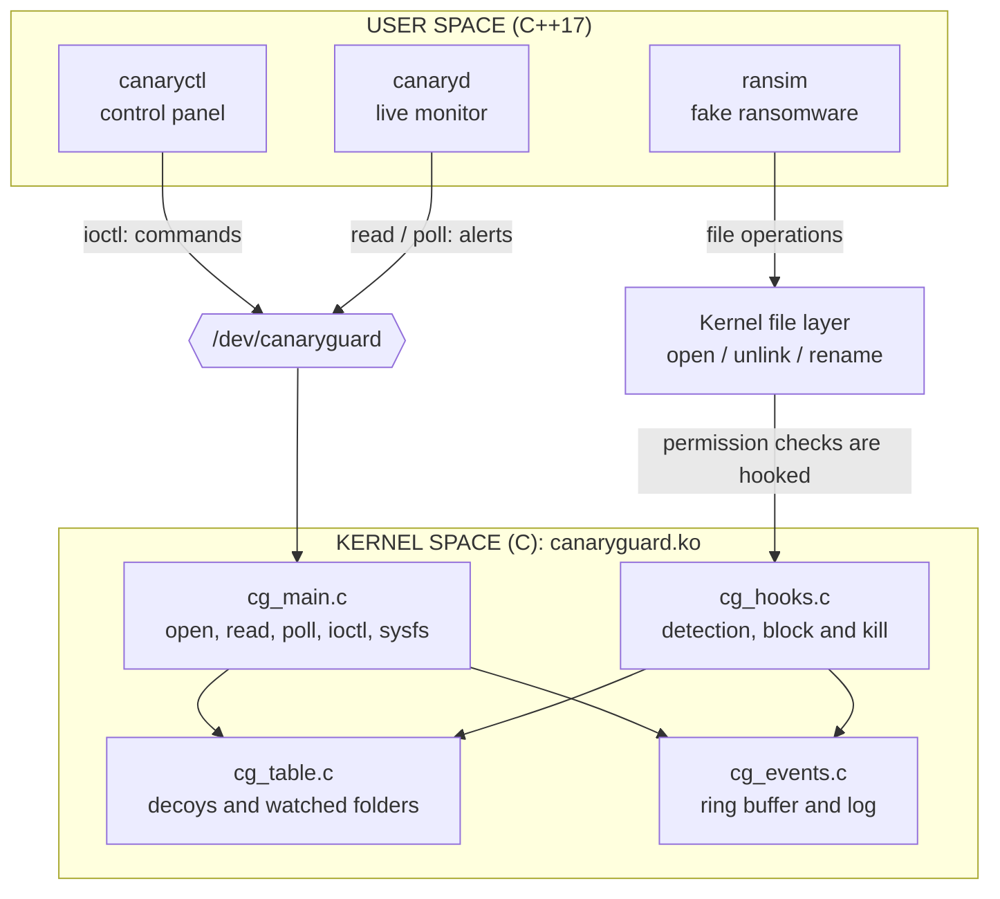

# CanaryGuard

**A Linux kernel driver that catches ransomware in the act.** It plants bait files, watches how fast programs change files, and, from inside the kernel, blocks the operation and kills the attacker.

Capstone project for the Wipro Embedded Track (Linux System Programming + Linux Device Drivers).
Kernel driver in **C**, user-space tools in **C++17**, **Linux only**.

---

## The idea in one minute

*Ransomware* scrambles (encrypts) every file it can reach and then demands money. It works fast, going through a folder file after file.

Every program on Linux has to ask the **kernel** before it opens, changes, deletes or renames a file. CanaryGuard is a **device driver that sits at that gate**, so it sees every attempt and the attacker cannot go around it. It uses three layers of defence:

| # | Trap | What it is | Catches | Response |
|---|------|-----------|---------|----------|
| 1 | **Canary files** | Bait documents (`Budget_2026.xlsx`, ...) that no real user ever changes | Ransomware, the moment it touches one | block the operation, **kill the process** |
| 2 | **Speed check** | A rule: *10 different files changed within 2 seconds* inside a watched folder | Ransomware that never touches a bait file | block the operation, **kill the process** |
| 3 | **Honeytoken** | A fake secrets file (`passwords.txt`) | A thief or spy program looking for passwords | **alert** (which program, which user, when) |

Every incident is delivered to a live monitor through a kernel **ring buffer** and `/dev/canaryguard`.



---

## Quick start (Ubuntu 24.04)

```bash
git clone https://github.com/suryaranjan21/canaryguard.git
cd canaryguard

make deps      # once: compiler + the headers of your running kernel
make           # build the kernel driver and the four tools
make test      # loads the driver and runs 50 automatic PASS/FAIL checks
make demo      # guided, narrated live demo (press Enter between acts)
sudo make unload
```

> Run this in a **Linux virtual machine**, not on a machine you care about: a driver runs inside the kernel. See [docs/SETUP.md](docs/SETUP.md) for how to get Ubuntu on Windows, and for troubleshooting.

### What the demo shows

```text
=== Act 1: an attack WITHOUT protection ===
  [20/20] encrypting Wedding_Video_Clip.mp4
  [PASS] nothing stopped the attack: 20 of 20 files are encrypted

=== Act 2: layer 1, canary files ===
  [ 3/25] encrypting Appraisal_Letter.pdf
  [ 4/25] encrypting Budget_2026.xlsx
15:16:23   KILLED   ransim[9138] uid=1000(student) tried to write to canary file .../Budget_2026.xlsx
  -> killed by the kernel (signal 9)
  [PASS] it got through only 3 files before it touched a canary
  [PASS] the canary files are untouched

=== Act 3: layer 2, the speed check ===
  [10/20] encrypting Holiday_Photo_02.jpg
15:16:23   KILLED   ransim[9141] uid=1000(student) changed 10 files within 2000 ms in .../3_speed
  [PASS] only 9 files were encrypted: the 10th file was protected

=== Act 4: the honeytoken (fake secrets) ===
  [PASS] cat was NOT killed (reading is only suspicious, not destructive)
  [PASS] but the driver raised a honeytoken alert
```

A complete run is in [docs/SAMPLE_RUN.txt](docs/SAMPLE_RUN.txt).

---

## The four programs

| Program | Language | Role |
|---------|----------|------|
| `canaryguard.ko` | C | **The driver.** Creates `/dev/canaryguard`, hooks the kernel's file permission checks, runs the three traps, blocks + kills attackers, queues alerts |
| `canaryctl` | C++ | **Control panel.** Plants bait, lists what is guarded, shows statistics, switches modes, manages the safe list |
| `canaryd` | C++ | **Live monitor.** Shows alerts in colour, writes a log, runs as a background daemon, re-checks canary files with SHA-256 |
| `ransim` | C++ | **Fire drill.** A *harmless* ransomware imitation for demos and tests. It refuses to touch any folder that is not a marked demo folder, and its "encryption" is a reversible XOR |

`cgdemo` (C++) runs the narrated demo and the automatic test suite.

## Using it on your own folder

```bash
make load                                  # load the driver
sudo build/canaryd                         # live monitor (use a second terminal)
sudo build/canaryctl plant ~/test-folder   # bait + speed check for this folder
sudo build/canaryctl list                  # see what is guarded
sudo build/canaryctl stats                 # counters and settings
sudo build/canaryctl mode warn             # alerts only; "mode kill" blocks + kills
sudo build/canaryctl speed 20 2000         # change the limit: 20 files in 2000 ms
sudo build/canaryctl allow rsync           # never block/kill this program name
sudo build/canaryctl clear                 # stop guarding everything
```

Use a **test folder**, not a busy real one: copying or unpacking more than the limit's worth of files inside a watched folder looks exactly like an attack (see *Limitations*).

Settings can also be given when loading the driver: `sudo insmod kernel/canaryguard.ko mode=0 speed_threshold=20`. They are visible in `/sys/module/canaryguard/parameters/`, and live statistics in `/sys/class/canaryguard/canaryguard/stats`.

## How it works, briefly

1. **Seeing every file operation.** The kernel calls a permission-check function whenever a file is opened (`security_file_open`), deleted (`security_inode_unlink`) or renamed (`security_inode_rename`). The driver attaches a **kretprobe** to each: one handler runs when the function is *entered* (we inspect the request), another when it *returns* (we may change the answer to "permission denied").
2. **Is it a decoy?** The driver keeps a spinlock-protected list of decoy files (compared by inode) and watched folders (compared by directory ancestry).
3. **Reacting.** For a violation in `kill` mode it makes the permission check fail with `-EPERM` (the open / delete / rename never happens, so the file is not even truncated) and sends `SIGKILL` to the offender.
4. **Reporting.** The hook may not sleep, so it only copies a small record into a fixed-size **kfifo ring buffer** and wakes the reader. A **workqueue** writes the line to the kernel log later. If the buffer is full, the event is dropped *and counted*, and `canaryd` says so.

More detail, UML diagrams and the reasons behind each decision: [docs/ARCHITECTURE.md](docs/ARCHITECTURE.md).

## Project structure

```text
canaryguard/
├── README.md               this file
├── LICENSE                 GPL-2.0
├── Makefile                make / load / unload / test / demo / stress / clean
├── include/
│   └── canaryguard_uapi.h  the contract between kernel and user space (shared by C and C++)
├── kernel/                 the driver (C)
│   ├── cg_main.c           module init/exit, /dev/canaryguard, ioctl, sysfs, parameters
│   ├── cg_table.c          decoy table, watched folders, safe list (spinlock)
│   ├── cg_hooks.c          kretprobes, speed check, kill, deny
│   ├── cg_events.c         kfifo ring buffer, wait queue, workqueue
│   ├── cg_internal.h       private declarations
│   └── Makefile            Kbuild file
├── tools/                  user space (C++17)
│   ├── canaryctl.cpp       control panel
│   ├── canaryd.cpp         live monitor / daemon
│   ├── ransim.cpp          harmless fake ransomware
│   ├── cgdemo.cpp          narrated demo + automatic tests
│   ├── cg_common.hpp       RAII file descriptor, Device wrapper, alert text
│   ├── sandbox.hpp         demo folders shared by ransim and cgdemo
│   └── sha256.hpp          dependency-free SHA-256
└── docs/
    ├── ARCHITECTURE.md     design, data flow, UML diagrams, decisions
    ├── REQUIREMENTS.md     requirements, traceability, plan, risks
    ├── SETUP.md            getting Linux on Windows, build, troubleshooting
    ├── DEMO_SCRIPT.md      a 5-minute demo, what to say
    ├── VIVA_QA.md          likely questions with plain answers
    └── SAMPLE_RUN.txt      output of a complete `make test`
```

## Course concepts used

| Course module | Where it appears |
|---------------|------------------|
| **LDD** kernel modules, `printk`, `module_param` | `cg_main.c`: load/unload, parameters `mode`, `speed_check`, `speed_threshold`, `speed_window_ms` |
| **LDD** character device, file operations, `copy_to_user` / `copy_from_user` | `/dev/canaryguard`: `open`, `read`, `poll`, `unlocked_ioctl`, `release` |
| **LDD** synchronization | `cg_table.c`, `cg_hooks.c`: spinlocks with `irqsave`, a mutex for readers, atomic counters |
| **LDD** deferred work, top and bottom halves | `cg_events.c`: the hook does the minimum, a workqueue prints to the log |
| **LDD** device model, sysfs | `class_create`, `device_create_with_groups`, `/sys/class/canaryguard/canaryguard/stats` |
| **LDD** kernel memory | `kzalloc`, `kfifo_alloc`; `GFP_KERNEL` vs. atomic context |
| **LDD** testing in a virtual environment | everything is developed and tested in an Ubuntu VM |
| **LSP** kernel vs. user space, system calls | the hooks sit on the path of `open`, `unlink`, `rename` |
| **LSP** file descriptors, `poll`, signals, daemon | `canaryd`: `poll()` + `signalfd`, double-fork daemon; the driver sends `SIGKILL` |
| **LSP** processes | `fork` / `exec` / `waitpid` in `cgdemo`; process name, PID and UID in every alert |
| **C++** classes, RAII, STL, exceptions, templates | `cg::Fd`, `cg::Device`, `std::map`, `std::vector`, `std::optional`, `std::filesystem` |
| **C++** threads, `mutex`, `condition_variable` | `canaryd`'s integrity-watcher thread |
| **Software architecture** | layered design, Observer pattern (`AlertSink`), RAII, facade (`Device`) |
| **SDLC / UML** | [REQUIREMENTS.md](docs/REQUIREMENTS.md) and the UML diagrams in [ARCHITECTURE.md](docs/ARCHITECTURE.md) |
| **Git** | the commit history follows the build order |

## Testing

| What | How | Result |
|------|-----|--------|
| End-to-end behaviour | `make test`: 50 automatic checks (all three layers, warn mode, safe list, delete/rename, slow attacker, ring-buffer overflow, bad input, permissions) | all pass |
| Load / unload | `make stress`: 20 cycles | no failure, no leak |
| Concurrency | 8 loops of heavy file activity + two attackers being killed over and over + decoys rewritten continuously + **unloading the driver in the middle of it** | no crash, no kernel warning |
| Overhead | open+close micro-benchmark | about **0.1 to 0.14 µs** added per `open()` (569 ns to about 680-710 ns) |
| Kernel versions | built with extra warnings (`W=1`) against 6.8, 6.14, 6.17 and 7.0 headers; the full suite and the stress tests were **run** on 6.8 and on 7.0 | compiles without warnings; all pass on both |

Run on Ubuntu 24.04 (arm64) with kernels 6.8.0-134 and 7.0.0-38. The build check for 6.14 and 6.17 was done on arm64.

## Limitations (what it cannot do)

Being honest about these is part of the design:

- **It limits damage, it does not undo it.** Files encrypted *before* the attacker is caught stay encrypted (3 files in the demo). Real products pair this with backups or snapshots.
- **A slow attacker passes the speed check** (the check needs 10 different files within 2 seconds). It is still caught the moment it touches a canary: that is why there are two layers.
- **Normal bulk work inside a watched folder looks like an attack.** Copying 12 files at once is stopped. Use `warn` mode, the `allow` list, or watch a different folder.
- **The safe list works by process name**, which an attacker could imitate. Real products identify programs by a signature or hash.
- **Someone with root can switch the guard off** (`rmmod`). It protects against malware running as an ordinary user or as a compromised program, not against a full system takeover.
- **Not every write is seen:** writing through `truncate(2)` by path, or through a file that was already open before the decoy was registered, is not hooked. `canaryd`'s SHA-256 integrity check is the second line of defence for these cases.
- **An attacker that starts a new process for every file** defeats the speed check, because the count is kept per process. The canary layer still stops it (verified by a test).
- **Unmounting** a file system that holds a decoy fails until `canaryctl clear` is run (the driver keeps the file pinned).
- This is a learning prototype, **not a production security product**.

## Safety

- The driver can only be controlled by root (`/dev/canaryguard` is mode 0600, and every command checks `CAP_SYS_ADMIN`).
- It refuses to watch system folders (`/`, `/usr`, `/etc`, `/var`, `/tmp`, ...) so it cannot be pointed at the operating system.
- Kernel threads, `init` and the safe-listed tools are never killed.
- `ransim` only works in folders carrying a marker file created by `ransim --setup`, so it cannot harm real data.

## Future work

The Domain 4 ideas this project deliberately leaves out, each a project of its own: a **syscall auditor and zero-trust behaviour agent**, a **rootkit and memory-guard subsystem**, and a **virtual TPM key enclave**. Natural next steps for CanaryGuard itself: snapshot-based file recovery, identifying programs by hash instead of name, per-user policies, and an eBPF-based variant.

## License

GPL-2.0 (see [LICENSE](LICENSE)). The kernel module must be GPL because it uses GPL-only kernel interfaces (kprobes).

## Author

Suryaranjan Sahoo ([@suryaranjan21](https://github.com/suryaranjan21))
