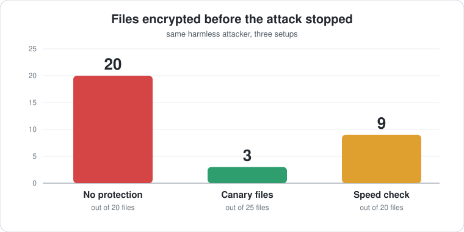
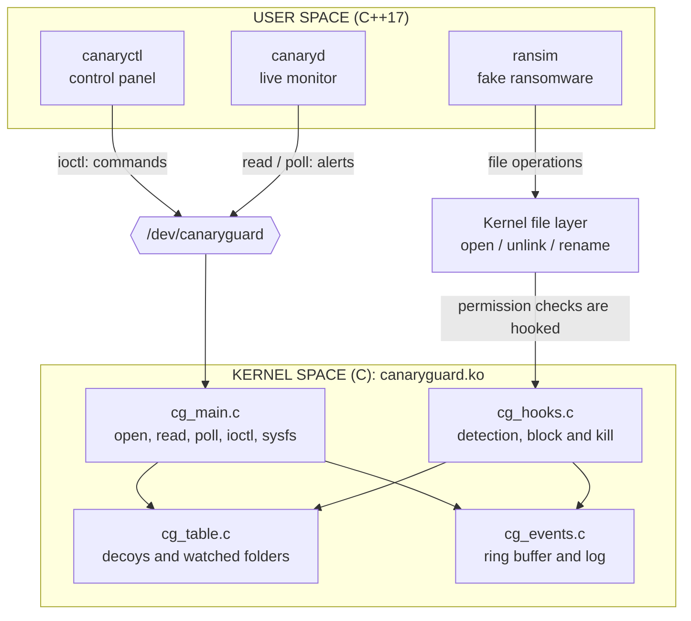
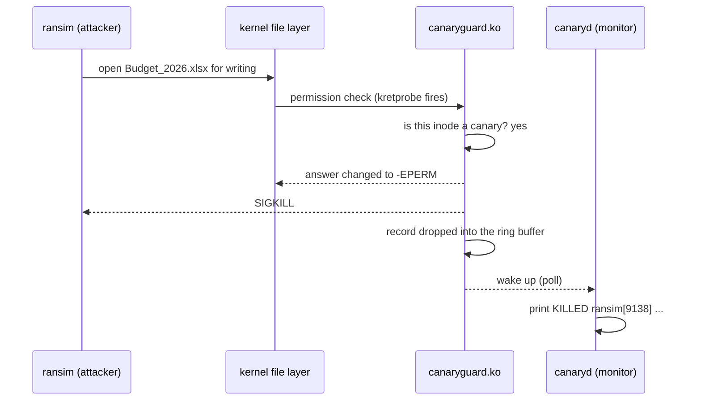

# CanaryGuard

**A guard inside the Linux kernel that stops ransomware while it is still attacking.**

    

Think of a dummy wallet left on a shop counter: honest customers ignore it, a thief grabs it, the alarm rings. CanaryGuard does that for files, **inside the kernel**, where every file operation has to pass.

[Watch it work](#watch-it-stop-three-different-attacks) · [Run it](#run-it) · [How it works](#how-it-works) · [Tests](#tested) · [Limits](#limits) · [Docs](#docs)

> Capstone project, Wipro Embedded Track (Linux System Programming + Linux Device Drivers). Kernel driver in **C**, tools in **C++17**, Linux only.

---

## Watch it stop three different attacks

Same harmless attacker (`ransim`), three different tricks, three traps. Each replay loops.

### 1 · It hits a bait file: **canary files**
> Fake documents no real user ever edits. Touch one and the process is killed.



### 2 · It skips the bait but is far too fast: **speed check**
> No human changes 10 different files in 2 seconds. A program does.



### 3 · Someone snoops for passwords: **honeytoken**
> A fake `passwords.txt`. Reading it raises an alert. Changing it gets you killed.



### What it saves



<details>
<summary><b>Why three traps and not one?</b></summary>

Each one covers a hole in the others, and the test suite proves every case:

- **too slow** for the speed check? It still dies at the first canary.
- **avoids the bait**? The speed check catches it.
- **renames or hard-links a canary**? Nothing gained: matching is by inode, not by name.
- **new process for every file**? Escapes the speed check, not the canaries.

</details>

*The output in the replays is from the real demo run. Paths are shortened, and PIDs and the user name are examples.*

## Run it

Inside an Ubuntu VM ([how to get one](docs/SETUP.md)). A kernel driver should never be a first experiment on a machine you care about.

```bash
make deps     # once: compiler and the headers of your running kernel
make          # build the driver and the four tools
make demo     # the narrated live demo, about 3 minutes (Enter between acts)
```

`make test` runs the same story without pauses: 50 PASS/FAIL checks.
There is **no GUI**. A driver lives in the terminal, `/dev`, `/sys` and `dmesg`.

## How it works



| Step | What happens |
|---|---|
| **See** | kretprobes on `security_file_open`, `security_inode_unlink`, `security_inode_rename` |
| **Decide** | a spinlock-protected table of decoys (by inode) and watched folders |
| **React** | the permission check fails with `-EPERM` and the offender gets `SIGKILL` |
| **Report** | hook drops a record in a kfifo ring buffer; a workqueue logs it, `canaryd` shows it |

<details>
<summary><b>Replay one attack, step by step</b></summary>



</details>

Full design, UML and the reasoning behind every choice: **[docs/ARCHITECTURE.md](docs/ARCHITECTURE.md)**.

## The programs

| Program | Lang | Role |
|---|---|---|
| `canaryguard.ko` | C | the driver: `/dev/canaryguard`, the three traps, block and kill, alert queue |
| `canaryctl` | C++ | control panel: plant bait, list, stats, modes, limits, safe list |
| `canaryd` | C++ | live monitor: colour alerts, log file, daemon mode, SHA-256 integrity check |
| `ransim` | C++ | a **harmless** ransomware imitation, fully reversible |
| `cgdemo` | C++ | the narrated demo and the 50-check test suite |

<details>
<summary><b>Commands to try</b></summary>

```bash
make load                                  # load the driver
sudo build/canaryd                         # live monitor (in a second terminal)
sudo build/canaryctl plant ~/test-folder   # bait and speed check for this folder
sudo build/canaryctl watch ~/test-folder   # speed check only, no bait
sudo build/canaryctl stats                 # counters and settings
sudo build/canaryctl mode warn             # alert without killing
sudo build/canaryctl allow rsync           # never block this program
sudo build/canaryctl clear                 # stop guarding everything
```

Settings also work at load time (`sudo insmod kernel/canaryguard.ko mode=0 speed_threshold=20`), appear under `/sys/module/canaryguard/parameters/`, and live counters under `/sys/class/canaryguard/canaryguard/stats`.

</details>

## Tested

| **50 / 50** | **6.8 and 7.0** | **+0.11 to +0.14 µs** | **20 / 20** |
|:---:|:---:|:---:|:---:|
| checks pass | kernels, full suite run | added to each `open()` | load/unload cycles |

<details>
<summary><b>Full test table</b></summary>

| What | How | Result |
|---|---|---|
| Behaviour | `make test`: 50 checks: all three layers, warn mode, safe list, delete and rename, evasion attempts, ring-buffer overflow, bad input, permissions, the monitor | all pass |
| Kernels | the full suite **run** on 6.8 and 7.0; built with `W=1` against 6.8, 6.14, 6.17 and 7.0 | pass, no warnings |
| Intel / AMD | driver and all tools **cross-built for x86-64** against Ubuntu's 6.8 Intel headers with `W=1`; the shared data-layout size checks hold | no warnings, no unresolved kernel symbols |
| Load and unload | `make stress`: 20 cycles | no failure, no leak |
| Concurrency | 8 parallel file-activity loops, attackers killed over and over, the decoy table rewritten continuously, **then the driver unloaded in the middle of it** | no crash, no kernel warning |
| Overhead | open+close micro-benchmark | **+0.11 to +0.14 µs** per `open()` |

Measured on Ubuntu 24.04, arm64, kernels 6.8.0-134 and 7.0.0-38.

</details>

## Limits

Stated plainly, because knowing them is part of the design:

- It **limits** damage, it does not undo it: files encrypted before the catch stay encrypted.
- A **slow** attacker, or one that **starts a new process per file**, passes the speed check (both still die at a canary).
- Bulk work in a watched folder (copying 12 files at once) looks like an attack: use `mode warn`, `allow`, or a higher limit.
- The safe list matches **process names**, which can be imitated.
- **Root can unload the driver.** It defends against malware running as a user, not a full takeover.
- A file **already open** before it was registered can still be written; the SHA-256 check is the backstop.
- A learning prototype, **not a production security product**.

<details>
<summary><b>Safety rules built in</b></summary>

Only root can control the driver (`/dev/canaryguard` is mode 0600, plus a `CAP_SYS_ADMIN` check on every command). It refuses to watch system folders (`/`, `/usr`, `/etc`, ...). It never kills kernel threads, `init`, or its own tools. `ransim` only touches folders that carry a marker file it created itself.

</details>

## Docs

| | |
|---|---|
| [ARCHITECTURE.md](docs/ARCHITECTURE.md) | design, data flow, UML diagrams, every decision and the alternatives |
| [REQUIREMENTS.md](docs/REQUIREMENTS.md) | requirements traced to the tests that verify them, plan, risks |
| [SETUP.md](docs/SETUP.md) | getting Ubuntu on Windows, building, troubleshooting |

<details>
<summary><b>Course concepts used</b></summary>

| Module | Where it appears |
|---|---|
| **LDD** modules, `printk`, `module_param` | load and unload; parameters `mode`, `speed_check`, `speed_threshold`, `speed_window_ms` |
| **LDD** character device, file operations, `copy_to/from_user` | `/dev/canaryguard`: `open`, `read`, `poll`, `unlocked_ioctl`, `release` |
| **LDD** synchronization | spinlocks with `irqsave`, a reader mutex, atomic counters |
| **LDD** deferred work (top and bottom half) | the hook queues the event; a workqueue writes it to the log |
| **LDD** device model, sysfs | `class_create`, `device_create_with_groups`, the `stats` attribute |
| **LDD** kernel memory | `kzalloc`, `kfifo_alloc`, `GFP_KERNEL` vs. atomic context |
| **LSP** kernel vs. user space, system calls | the hooks sit on the path of `open`, `unlink` and `rename` |
| **LSP** descriptors, `poll`, signals, daemons | `canaryd`: `poll()` with `signalfd`, double-fork daemon; the driver sends `SIGKILL` |
| **LSP** processes | `fork`, `exec` and `waitpid` in `cgdemo`; program, PID and UID in every alert |
| **C++** classes, RAII, STL, exceptions | `cg::Fd`, `cg::Device`, `std::map`, `std::optional`, `std::filesystem` |
| **C++** threads, `mutex`, `condition_variable` | the integrity-watcher thread |
| **Architecture** | layered design, Observer (`AlertSink`), facade (`Device`), SOLID |
| **SDLC and UML** | [REQUIREMENTS.md](docs/REQUIREMENTS.md) and the diagrams in [ARCHITECTURE.md](docs/ARCHITECTURE.md) |

</details>

<details>
<summary><b>Project layout</b></summary>

```text
canaryguard/
├── Makefile                deps / build / load / unload / demo / test / stress / clean
├── include/
│   └── canaryguard_uapi.h  the kernel-to-user contract, shared by the C and C++ sides
├── kernel/                 the driver (C)
│   ├── cg_main.c           module init and exit, character device, ioctl, sysfs, parameters
│   ├── cg_table.c          decoys, watched folders, safe list (spinlock)
│   ├── cg_hooks.c          kretprobes, speed check, block and kill
│   ├── cg_events.c         kfifo ring buffer, wait queue, workqueue
│   └── Makefile            Kbuild
├── tools/                  user space (C++17)
│   ├── canaryctl.cpp  canaryd.cpp  ransim.cpp  cgdemo.cpp
│   └── cg_common.hpp  sandbox.hpp  sha256.hpp
└── docs/                   architecture, requirements, setup, images
```

</details>

**Future work:** the Domain 4 ideas left out on purpose (a syscall auditor and zero-trust agent, a rootkit and memory-guard subsystem, a virtual TPM), plus snapshot recovery, identifying programs by hash, per-user policies and an eBPF variant.

**License:** GPL-2.0 ([LICENSE](LICENSE)). The module must be GPL because kprobes are a GPL-only kernel interface.

**Author:** Suryaranjan Sahoo ([@suryaranjan21](https://github.com/suryaranjan21))
