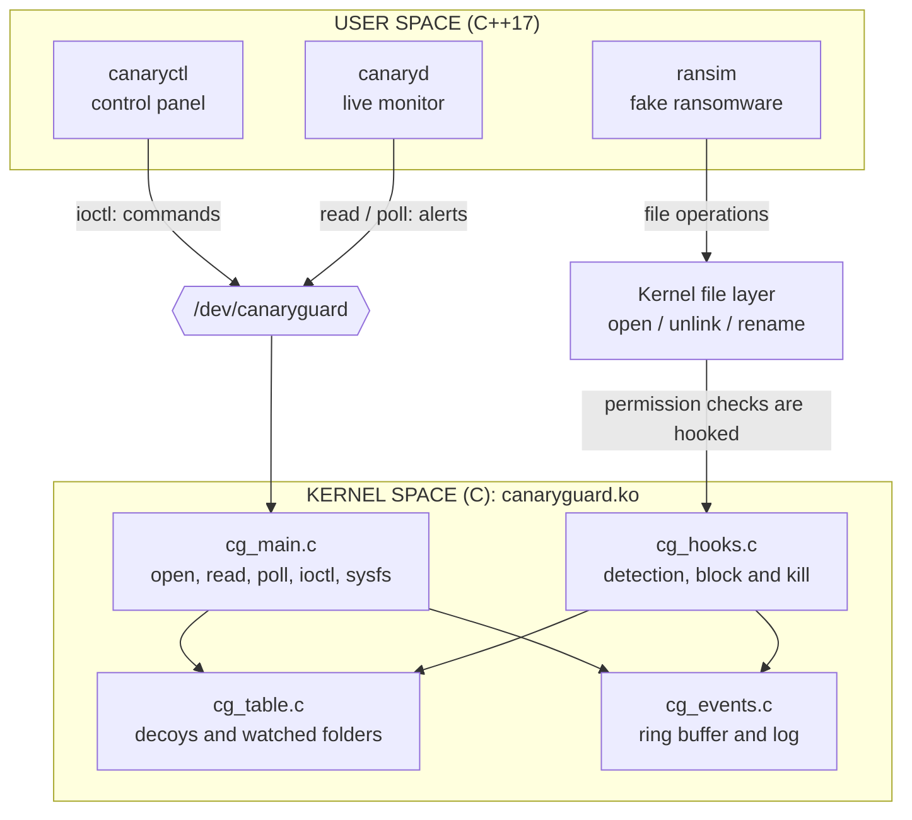

# CanaryGuard

**A Linux kernel driver that catches ransomware in the act and kills it.**

    

Ransomware encrypts your files one after another and then demands money. Every program has to ask the **kernel** before it touches a file, so CanaryGuard puts a guard at exactly that gate: it cannot be bypassed from user space, and it stops the attacker in the middle of its run.

```console
$ ransim --attack ~/documents          # a harmless ransomware imitation

  [ 1/25] encrypting Agreement_Rent.docx
  [ 2/25] encrypting Agreement_Vehicle.docx
  [ 3/25] encrypting Appraisal_Letter.pdf
  [ 4/25] encrypting Budget_2026.xlsx          <-- a bait file
Killed                                         <-- the kernel stopped it here
```

```text
17:02:11   KILLED   ransim[9138] uid=1000(student) tried to write to canary file
                    ~/documents/Budget_2026.xlsx  -> operation blocked, process killed
```

The other 21 files were never touched, and the bait file itself is intact, byte for byte.

> Capstone project for the Wipro Embedded Track (Linux System Programming + Linux Device Drivers). Kernel driver in **C**, user-space tools in **C++17**, Linux only.

---

## Three layers of defence

| | Layer | How it spots an attacker | What it does |
|---|---|---|---|
| 1 | **Canary files** | Bait documents (`Budget_2026.xlsx`, ...) that no real user ever modifies | block the operation, **kill the process** |
| 2 | **Speed check** | Counts *different* files one process changes: 10 within 2 seconds is not a human | block the operation, **kill the process** |
| 3 | **Honeytoken** | A fake `passwords.txt`; nobody honest ever opens it | **alert** with program, PID and user |

They cover each other's blind spots, and the test suite proves each case:

- an attacker **too slow** for the speed check still dies at the first canary
- an attacker that **avoids the bait** is caught by the speed check
- an attacker that **renames a canary or hard-links it** gains nothing: matching is by inode, not by name
- an attacker that **starts a new process for every file** escapes the speed check, but not the canaries

## Try it in three commands

Inside an Ubuntu VM ([how to get one](docs/SETUP.md) — a kernel driver should never be a first experiment on a machine you care about):

```bash
make deps     # once: compiler and the headers of your running kernel
make          # build the driver and the four tools
make demo     # the narrated live demo, about 3 minutes
```

`make test` runs the same story without pauses and prints 50 PASS/FAIL checks.

**There is no GUI and no web page.** This is a kernel driver, so it lives in the terminal and in `/dev`, `/sys` and `dmesg`, which is where a driver belongs.

## How it works



1. **Seeing everything.** The kernel runs a permission check before every open, delete and rename. The driver attaches a **kretprobe** to `security_file_open`, `security_inode_unlink` and `security_inode_rename`: one handler inspects the request on the way in, another can change the answer on the way out.
2. **Deciding.** A spinlock-protected table holds the decoys (matched by inode) and the watched folders (matched by directory ancestry).
3. **Reacting.** The permission check is made to fail with `-EPERM`, so the file is never even truncated, and the offender gets `SIGKILL`.
4. **Reporting.** A kernel hook may not sleep, so it only drops a record into a **kfifo ring buffer** and wakes the monitor; a **workqueue** writes to the kernel log afterwards. If the buffer is ever full, the loss is counted and reported, never silent.

The full design, the UML diagrams and the reasoning behind every choice: **[docs/ARCHITECTURE.md](docs/ARCHITECTURE.md)**.

## The programs

| Program | Lang | Role |
|---|---|---|
| `canaryguard.ko` | C | the driver: `/dev/canaryguard`, the three traps, block and kill, the alert queue |
| `canaryctl` | C++ | control panel: plant bait, list, statistics, modes, limits, safe list |
| `canaryd` | C++ | live monitor: colour alerts, log file, daemon mode, SHA-256 integrity check |
| `ransim` | C++ | a **harmless** ransomware imitation: demo folders only, fully reversible |
| `cgdemo` | C++ | the narrated demo and the 50-check test suite |

```bash
make load                                  # load the driver
sudo build/canaryd                         # live monitor (in a second terminal)
sudo build/canaryctl plant ~/test-folder   # bait and speed check for this folder
sudo build/canaryctl stats                 # counters and settings
sudo build/canaryctl mode warn             # alert without killing
sudo build/canaryctl allow rsync           # never block this program
sudo build/canaryctl clear                 # stop guarding everything
```

Settings also work at load time (`sudo insmod kernel/canaryguard.ko mode=0 speed_threshold=20`), appear under `/sys/module/canaryguard/parameters/`, and live counters under `/sys/class/canaryguard/canaryguard/stats`.

## Testing

| What | How | Result |
|---|---|---|
| Behaviour | `make test`: 50 checks — all three layers, warn mode, safe list, delete and rename, evasion attempts, ring-buffer overflow, bad input, permissions, the monitor | all pass |
| Kernels | the full suite **run** on 6.8 and 7.0; built with `W=1` against 6.8, 6.14, 6.17 and 7.0 | pass, no warnings |
| Load and unload | `make stress`: 20 cycles | no failure, no leak |
| Concurrency | 8 parallel file-activity loops, attackers killed over and over, the decoy table rewritten continuously, **then the driver unloaded in the middle of it** | no crash, no kernel warning |
| Overhead | open+close micro-benchmark | **+0.11 to +0.14 µs** per `open()` |

Measured on Ubuntu 24.04, arm64, kernels 6.8.0-134 and 7.0.0-38.

## Limitations

Stated plainly, because knowing them is part of the design:

- It **limits** damage, it does not undo it: files encrypted before the catch stay encrypted (3 of them in the demo).
- A **slow** attacker passes the speed check, and so does one that **starts a new process per file**. Both still die at a canary.
- Bulk work inside a watched folder (copying 12 files at once) looks like an attack: use `mode warn`, `allow`, or a higher limit.
- The safe list matches **process names**, which can be imitated.
- **Root can unload the driver.** This defends against malware running as a user, not against a full takeover.
- A file that was **already open** before it was registered can still be written; the monitor's SHA-256 check is the backstop.
- A learning prototype, **not a production security product**.

## Safety

Only root can control the driver (`/dev/canaryguard` is mode 0600, plus a `CAP_SYS_ADMIN` check on every command). It refuses to watch system folders (`/`, `/usr`, `/etc`, ...). It never kills kernel threads, `init`, or its own tools. `ransim` only touches folders that carry a marker file it created itself.

## Documentation

| | |
|---|---|
| [ARCHITECTURE.md](docs/ARCHITECTURE.md) | design, data flow, UML diagrams, every design decision and the alternatives |
| [REQUIREMENTS.md](docs/REQUIREMENTS.md) | requirements traced to the tests that verify them, plan, risks |
| [SETUP.md](docs/SETUP.md) | getting Ubuntu on Windows, building, troubleshooting |

<details>
<summary><b>Course concepts used</b> (click to expand)</summary>

| Module | Where it appears |
|---|---|
| **LDD** modules, `printk`, `module_param` | load and unload; parameters `mode`, `speed_check`, `speed_threshold`, `speed_window_ms` |
| **LDD** character device, file operations, `copy_to/from_user` | `/dev/canaryguard`: `open`, `read`, `poll`, `unlocked_ioctl`, `release` |
| **LDD** synchronization | spinlocks with `irqsave`, a reader mutex, atomic counters |
| **LDD** deferred work (top and bottom half) | the hook queues the event; a workqueue writes it to the log |
| **LDD** device model, sysfs | `class_create`, `device_create_with_groups`, the `stats` attribute |
| **LDD** kernel memory | `kzalloc`, `kfifo_alloc`, `GFP_KERNEL` vs. atomic context |
| **LSP** kernel vs. user space, system calls | the hooks sit on the path of `open`, `unlink` and `rename` |
| **LSP** descriptors, `poll`, signals, daemons | `canaryd`: `poll()` with `signalfd`, double-fork daemon; the driver sends `SIGKILL` |
| **LSP** processes | `fork`, `exec` and `waitpid` in `cgdemo`; program, PID and UID in every alert |
| **C++** classes, RAII, STL, exceptions | `cg::Fd`, `cg::Device`, `std::map`, `std::optional`, `std::filesystem` |
| **C++** threads, `mutex`, `condition_variable` | the integrity-watcher thread |
| **Architecture** | layered design, Observer (`AlertSink`), facade (`Device`), SOLID |
| **SDLC and UML** | [REQUIREMENTS.md](docs/REQUIREMENTS.md) and the diagrams in [ARCHITECTURE.md](docs/ARCHITECTURE.md) |

</details>

<details>
<summary><b>Project layout</b></summary>

```text
canaryguard/
├── Makefile                deps / build / load / unload / demo / test / stress / clean
├── include/
│   └── canaryguard_uapi.h  the kernel-to-user contract, shared by the C and C++ sides
├── kernel/                 the driver (C)
│   ├── cg_main.c           module init and exit, character device, ioctl, sysfs, parameters
│   ├── cg_table.c          decoys, watched folders, safe list (spinlock)
│   ├── cg_hooks.c          kretprobes, speed check, block and kill
│   ├── cg_events.c         kfifo ring buffer, wait queue, workqueue
│   └── Makefile            Kbuild
├── tools/                  user space (C++17)
│   ├── canaryctl.cpp  canaryd.cpp  ransim.cpp  cgdemo.cpp
│   └── cg_common.hpp  sandbox.hpp  sha256.hpp
└── docs/
```

</details>

## Future work

The Domain 4 ideas deliberately left out, each a project in its own right: a syscall auditor and zero-trust behaviour agent, a rootkit and memory-guard subsystem, and a virtual TPM key enclave. For CanaryGuard itself: snapshot-based recovery, identifying programs by hash instead of by name, per-user policies, and an eBPF variant.

## License

GPL-2.0 ([LICENSE](LICENSE)). The module must be GPL because kprobes are a GPL-only kernel interface.

## Author

Suryaranjan Sahoo ([@suryaranjan21](https://github.com/suryaranjan21))
