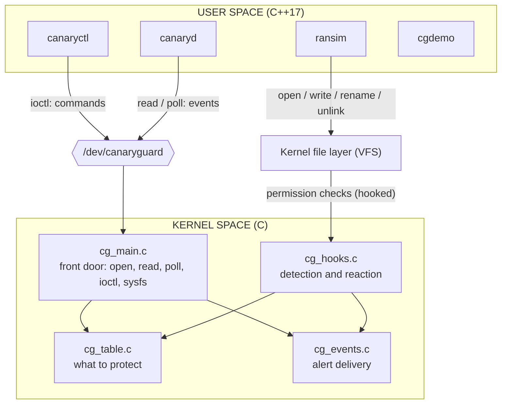
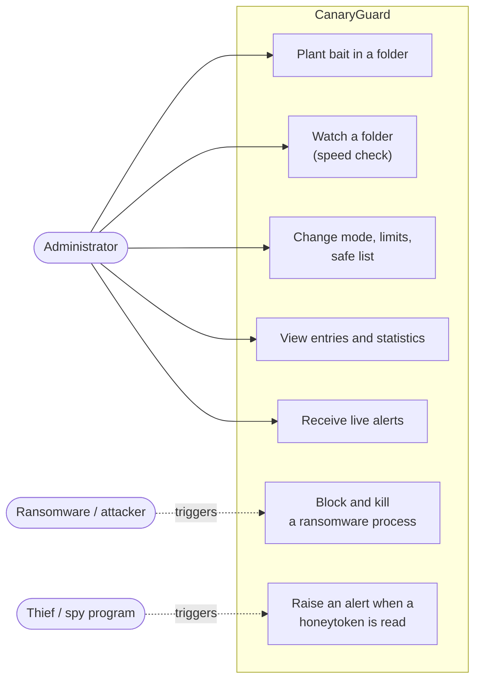
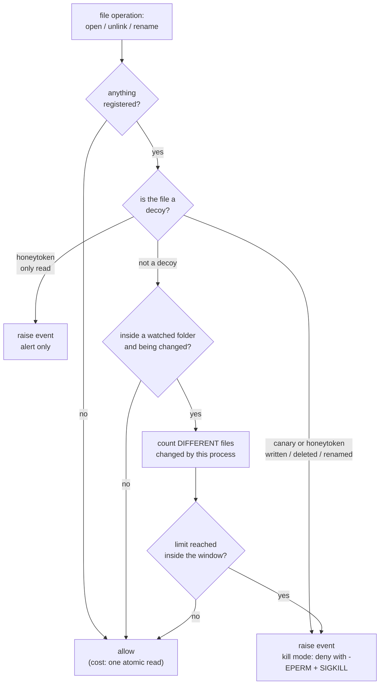
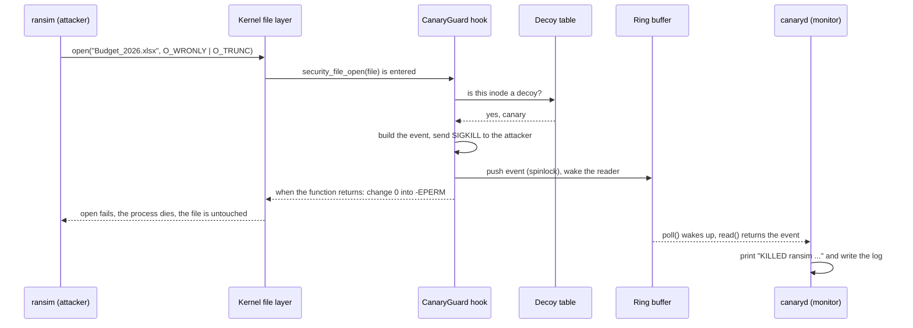
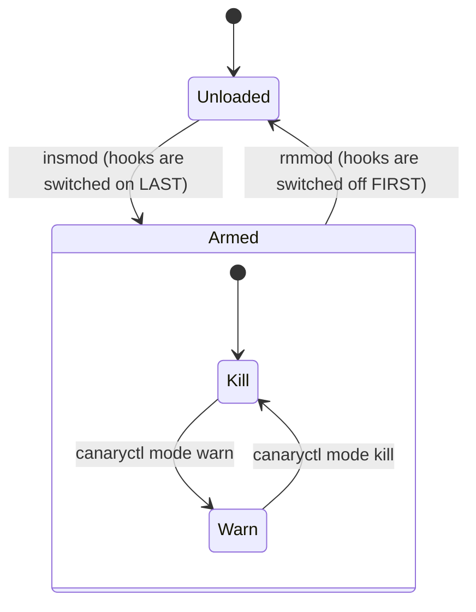
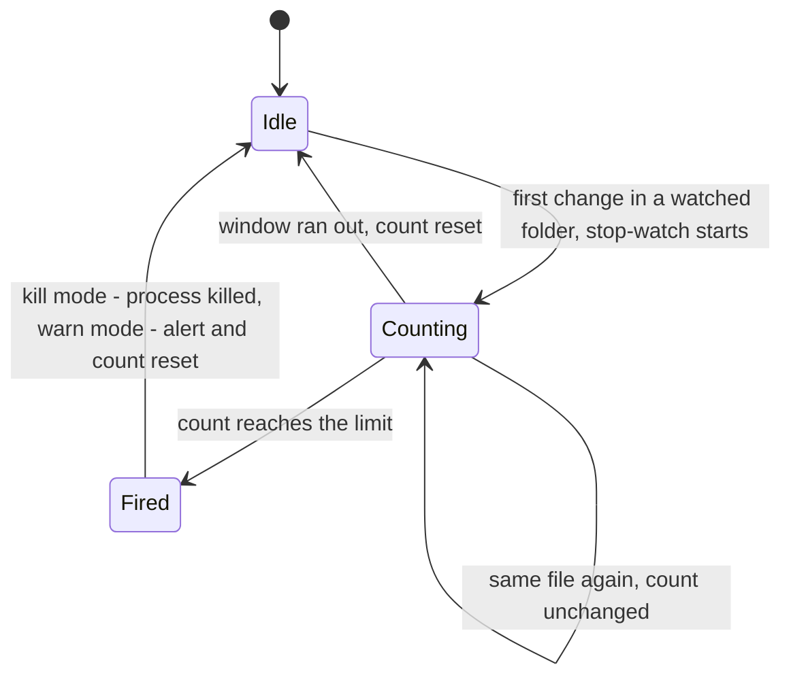
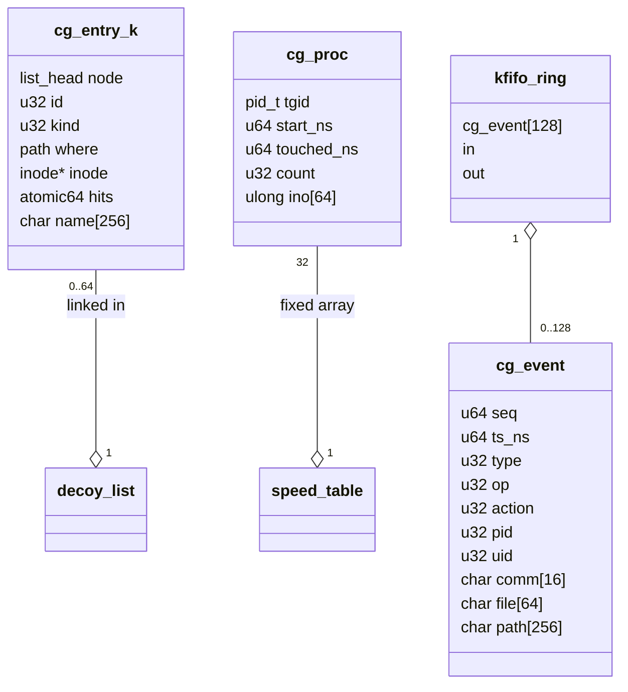
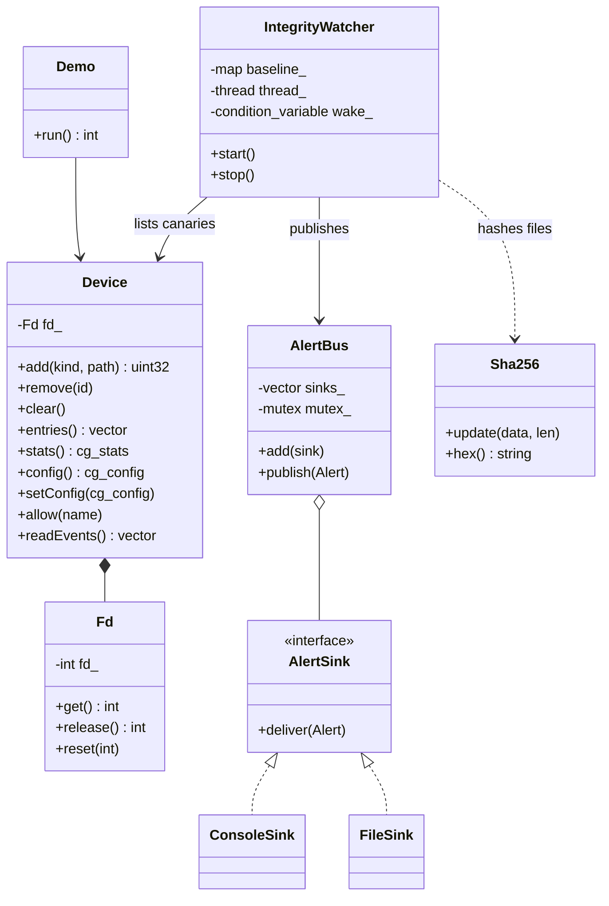

# Architecture and design

This document explains *how* CanaryGuard is built and *why* each decision was made. All diagrams are [Mermaid](https://mermaid.js.org/), which GitHub draws automatically.

Contents: [1. Overview](#1-overview) · [2. Use cases](#2-use-cases) · [3. The detection logic](#3-the-detection-logic) · [4. Sequence of an attack](#4-sequence-of-an-attack) · [5. State machines](#5-state-machines) · [6. Kernel data structures](#6-kernel-data-structures) · [7. User-space classes](#7-user-space-classes) · [8. Concurrency and locking](#8-concurrency-and-locking) · [9. The user/kernel interface](#9-the-userkernel-interface) · [10. Design decisions](#10-design-decisions) · [11. Portability](#11-portability)

---

## 1. Overview

CanaryGuard has two halves that talk through one device file:

- **Kernel space (C):** `canaryguard.ko` hooks the kernel's file permission checks and makes the decisions.
- **User space (C++):** tools that configure the driver (`canaryctl`), display its alerts (`canaryd`) and demonstrate it (`ransim`, `cgdemo`).

| Layer | File | Responsibility |
|-------|------|----------------|
| Front door | `cg_main.c` | module load/unload, the character device, ioctl commands, sysfs page, module parameters |
| Memory | `cg_table.c` | the list of canaries, honeytokens and watched folders; the safe list of process names |
| Brain | `cg_hooks.c` | the three kretprobes, the speed check, killing and denying |
| Messenger | `cg_events.c` | ring buffer to user space, wait queue, workqueue to the kernel log |
| Contract | `include/canaryguard_uapi.h` | every structure and ioctl number shared with user space |

---

## 2. Use cases

---

## 3. The detection logic

Every `open`, `unlink` and `rename` in the whole system passes through `cg_hooks.c`. The hook must therefore be **fast** and must **never sleep**.

### Why the attacker is stopped *before* the damage

For an `open()` the kernel runs its permission check (`security_file_open`) **before** it truncates the file (`O_TRUNC`). Our return-handler changes the answer from "allowed" to `-EPERM`, so the open fails and the file is never touched. In the demo the attacker's 4th file (the canary) and the 10th file (speed check) are both protected; only the files *before* them are lost.

(One detail: if the attacker *creates* a new file, the kernel has already created the empty file when the check runs. That empty file remains; no data is lost.)

---

## 4. Sequence of an attack

---

## 5. State machines

### The driver

### The speed check, for one process

The driver follows up to 32 processes at once in a fixed table (no memory allocation is allowed in the hook). When the table is full, the least recently seen process is replaced.

---

## 6. Kernel data structures

| Structure | Lives in | Size and bound |
|-----------|----------|----------------|
| decoy list (`cg_entry_k`) | `cg_table.c` | up to 64 entries; each pins its file with a `struct path` |
| safe list | `cg_table.c` | 8 process names |
| speed table (`cg_proc`) | `cg_hooks.c` | 32 processes x 64 remembered files, static array |
| ring buffer | `cg_events.c` | 128 events of 384 bytes (`kfifo_alloc`, i.e. `kmalloc`) |
| log queue | `cg_events.c` | 32 events, drained by a workqueue into `dmesg` |

---

## 7. User-space classes

Patterns and principles in use:

- **RAII** (`Fd`): a descriptor is closed automatically, even when an exception is thrown.
- **Facade** (`Device`): one small typed class hides the raw `ioctl` numbers.
- **Observer** (`AlertBus` / `AlertSink`): alerts are delivered to every registered sink; adding e-mail or network output changes no existing code (open/closed principle).
- **Single responsibility:** `canaryctl` configures, `canaryd` displays, `ransim` attacks, `cgdemo` orchestrates.

---

## 8. Concurrency and locking

The detection hooks run **on every CPU at the same time** and in a context where **sleeping is forbidden**. Therefore:

| Lock | Protects | Used by | Why this kind |
|------|----------|---------|---------------|
| `cg_lock` (spinlock, `irqsave`) | decoy list, safe list | hooks and ioctl | the hook cannot sleep, so no mutex |
| `cg_speed_lock` (spinlock) | per-process counters | hooks | same |
| `cg_prod_lock` (spinlock) | writing into the ring buffer | hooks | same |
| `cg_read_lock` (mutex) | reading from the ring buffer | `read()` | the reader may sleep |
| atomics | statistics, entry count | everywhere | no lock needed for a counter |

Rules followed everywhere:

1. Inside a spinlock only **non-sleeping** work is done.
2. Anything that can sleep (`path_put`, `kfree` of a path, `kzalloc(GFP_KERNEL)`) happens **after** the lock is released.
3. No two of our locks are ever held at the same time, so deadlock is impossible.
4. `spin_lock_irqsave` also disables local interrupts, so the lock can never be interrupted by code that wants the same lock.

---

## 9. The user/kernel interface

| Mechanism | Used for |
|-----------|----------|
| `read()` / `poll()` on `/dev/canaryguard` | events, one `struct cg_event` (384 bytes) each; `poll` lets the monitor sleep until something happens |
| `ioctl()` | commands: add / remove / clear decoys, list entries, statistics, get/set configuration, safe list, reset counters |
| sysfs `/sys/class/canaryguard/canaryguard/stats` | the same statistics as plain text, readable with `cat` |
| module parameters `/sys/module/canaryguard/parameters/` | `mode`, `speed_check`, `speed_threshold`, `speed_window_ms`: at load time or live |
| kernel log (`dmesg`) | one line per incident, written by the workqueue |

Every ioctl argument is copied with `copy_from_user` / `copy_to_user` (user pointers are never trusted), and every command first checks `capable(CAP_SYS_ADMIN)`.

---

## 10. Design decisions

| Decision | Alternatives considered | Reason |
|----------|------------------------|--------|
| **kretprobes** on `security_file_open`, `security_inode_unlink`, `security_inode_rename` | patching the syscall table; a Linux Security Module (LSM); `fanotify`; eBPF | The syscall table is read-only and its patching is unsupported on modern kernels. An LSM must be compiled into the kernel, not loaded as a module. `fanotify` and eBPF are valid but are not *device drivers*; the project is about drivers. A kprobe is the supported way for a loadable module to run code at a chosen kernel function. |
| **Entry + return handlers**: inspect on entry, change the result on return | kill only | Killing alone leaves the very operation that triggered detection to complete (an `O_TRUNC` open would still empty the file). Overriding the return value blocks it. |
| Compare decoys by **inode**, folders by **directory ancestry** (`is_subdir`) | compare path strings | Strings can be fooled by relative paths, symlinks and hard links; inodes cannot. |
| **Pin** decoys with a `struct path` | store only the inode number | While we hold the dentry, the inode cannot be freed and reused, so pointer comparison is safe. Side effect: a file system holding a decoy cannot be unmounted until `canaryctl clear`. |
| Speed check counts **different files**, per **process** | count all operations | A program that rewrites one log file a thousand times is not ransomware; one that touches ten different files is suspicious. |
| **Fixed-size** speed table | allocate per process | No allocation is allowed inside the hook. |
| Speed check only in **watched folders**, which may not be system folders | watch everything | Package managers and compilers legitimately change hundreds of files. |
| Ring buffer **drops the newest** event when full, and **counts** it | block the hook; overwrite the oldest | The hook must never wait. A counter turns "silently lost" into "N events lost", which `canaryd` reports. |
| **Workqueue** for `printk` | print inside the hook | Printing is slow; the hook is on the path of every file open in the system. |
| Safe list by **process name** | by executable hash | Simple and explainable; documented as a limitation. |
| Honeytoken **read = alert only**, **write = kill** | kill on read | Harmless tools (indexers, `cat`) read files; they never need to modify a fake secret. |
| Module is **GPL** | proprietary | `register_kretprobe` is `EXPORT_SYMBOL_GPL`. |
| Device node **0600**, `CAP_SYS_ADMIN` in every command | world-accessible | Whoever can configure the guard can switch it off. |

---

## 11. Portability

- **Same header, two languages:** `include/canaryguard_uapi.h` is included by the C kernel module and by the C++ tools. It uses only fixed-width types and explicit padding, and **both sides assert the size of every structure at build time** (`BUILD_BUG_ON` / `static_assert`).
- **Two CPU types:** function arguments are read with the kernel's generic `regs_get_kernel_argument()` and the result is changed with `regs_set_return_value()`. Both exist for ARM64 and x86-64, so there is no CPU-specific code.
- **Kernel versions:** the module is guarded for the API changes between 6.2 and 7.0 (`class_create` signature, `devnode` constness) and avoids interfaces that were removed (`no_llseek`). It was compile-tested without warnings against 6.8, 6.14, 6.17 and 7.0, and the whole test suite was run on 6.8 and 7.0.
- **Build:** a standard out-of-tree Kbuild module (`kernel/Makefile`) driven by the top-level `Makefile`.
